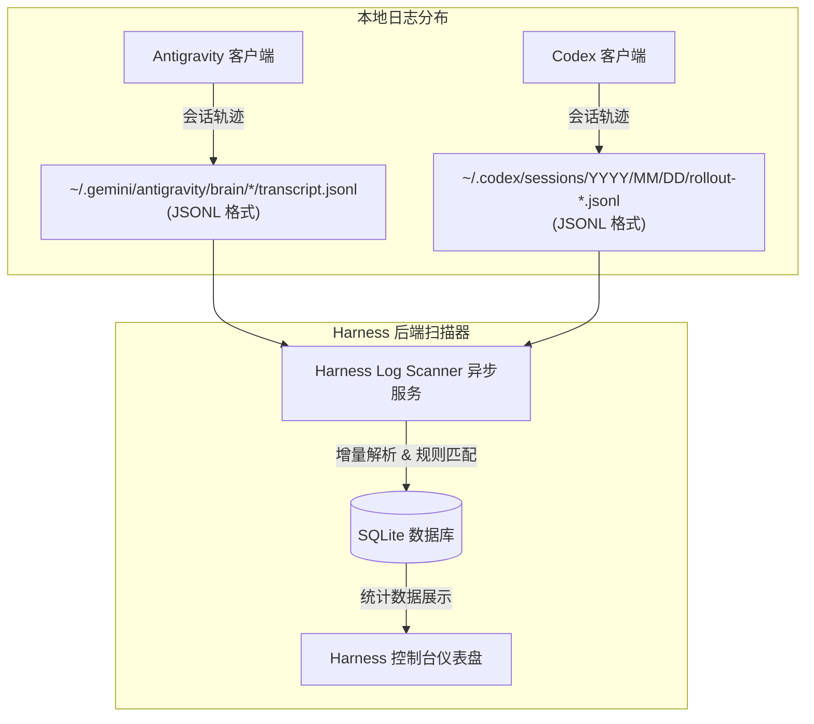

# 基于旁路日志扫描的 Agent 客户端 Skill/MCP 零配置统计方案

## 1. 方案背景与设计哲学
NoNo哥 在日常协作中提出了关键的约束要求：**不对现有的 Agent 客户端进行任何配置变动，不施加任何变动压力。**

在此约束下，我们放弃原有的“在线 API 拦截”或“MCP 代理网关”等对客户端通信链有侵入性的方案，转向 **“旁路日志异步扫描（Log-based Off-line Auditor）”** 路线。

### 核心设计哲学
- **客户端零感知**：外部客户端（Antigravity、Codex 等）依然使用其原生的文件读取方式和直连的 MCP 进程，完全不感知统计的存在。
- **配置全在 Harness 侧**：Harness Manager 仅需在本地以“只读扫描”的方式，对客户端产生的本地运行日志（会话记录）进行增量解析与统计。
- **历史数据可回溯**：由于是扫描本地已有的历史日志，该方案一旦启用，能够把客户端历史上的所有使用记录全部“同步”回数据库，直接丰富 Dashboard 数据。

---

## 2. 核心客户端日志路径与数据结构分析

经过现场调研，`antigravity` 和 `codex` 在本机都留有结构极其规范的本地会话日志，这为旁路扫描提供了完美的土壤。



### 2.1 Antigravity 的日志特征
- **日志路径**：`~/.gemini/antigravity/brain/<conversation-id>/.system_generated/logs/transcript.jsonl`
- **解析逻辑**：
  - 扫描其中的 `PLANNER_RESPONSE` 类型行。
  - 解析其中的 `tool_calls` 数组。
  - **Skill 使用判定**：如果 `tool_calls` 中包含 `view_file` 或 `read_file` 动作，且参数 `AbsolutePath` 指向我们已注册的 Skill 目录（如 `/skills/chrome-extensions`），则视为一次 **Skill 使用**。
  - **MCP 使用判定**：如果 `tool_calls` 中的 `name` 属于在 Harness 注册的非默认 MCP Tool，则视为一次 **MCP 调用**。

### 2.2 Codex 的日志特征
- **日志路径**：`~/.codex/sessions/YYYY/MM/DD/rollout-*.jsonl`（包含每天的多条 rollout 记录）
- **解析逻辑**：
  - 首行 `type: "session_meta"` 提供了 `originator` ("Codex Desktop")、工作区路径等元信息。
  - 逐行扫描 `type: "PLANNER_RESPONSE"` 或者工具执行行中的 `tool_calls`。
  - **Skill 使用判定**：若 `tool_calls` 中出现 `cat`、`view_file` 或 `apply_patch` 针对 Skill 路径下的文件（如 `/Users/jackdu/.codex/skills/...`），则匹配为一次 **Skill 使用**。
  - **MCP 使用判定**：若 `tool_calls` 调动了我们在 `dynamic_tools` 中发现的外部 MCP 进程工具，则匹配为一次 **MCP 调用**。

---

## 3. Harness 后端增量扫描与性能优化设计

为了防止扫描庞大的日志文件（例如 Codex 的 rollout 日志单文件可能达 50MB 以上）带来系统 IO 卡顿，我们必须设计一套**超轻量级的增量扫描机制**：

### 3.1 增量状态控制表
在 SQLite 数据库中新建 `scan_offsets` 表，用来记忆解析进度：
```sql
CREATE TABLE IF NOT EXISTS scan_offsets (
  file_path TEXT PRIMARY KEY,       -- 日志文件的绝对路径
  last_modified TEXT NOT NULL,       -- 上次扫描时的文件修改时间
  last_bytes_read INTEGER NOT NULL,  -- 上次扫描已读取的字节偏移量
  updated_at TEXT NOT NULL
);
```

### 3.2 扫描工作流 (Tauri Rust 后端实现)
1. **路径巡检**：定时器（如每 5 分钟或每次打开 Analytics 面板时）触发，遍历注册的 Agent 日志根目录，收集所有 `transcript.jsonl` 和 `rollout-*.jsonl`。
2. **进度对比**：
   - 如果文件路径不在 `scan_offsets` 中，或者文件修改时间（mtime）新于 `last_modified`，则判定需要扫描。
3. **定位读取 (Seek)**：
   - 打开文件，直接 `seek` 到 `last_bytes_read` 位置，跳过历史已读正文。
4. **流式行解析**：
   - 读取新增字节，按行解析为 JSON。
   - 提取其中的 `timestamp`、`tool_calls`（若有）。
   - 将匹配到的 Skill/MCP 使用记录批量写入 `resource_usage_events`。
5. **更新进度**：
   - 扫描完成后，更新 `scan_offsets` 中的 `last_modified` 和新的文件大小 `last_bytes_read`。

---

## 4. 该方案的优势与挑战评估

| 评估维度 | 旁路日志扫描方案 (本方案) | 改造客户端方案 (先前方案) |
| :--- | :--- | :--- |
| **客户端配置修改** | **零修改 (0 变动压力)** | 需要修改客户端 MCP 注册与加载链 |
| **实时性** | **准实时 (存在分钟级同步延迟)** | 完全实时 |
| **历史数据** | **可完全回溯历史使用频次** | 只能统计方案上线后的新调用 |
| **维护成本** | **中 (需适配客户端日志格式升级)** | 低 (一旦完成，API 协议相对稳定) |
| **安全与权限** | **高 (纯只读本地分析，不改逻辑)** | 较低 (需中转流量) |

### 关键挑战与应对措施：
* **日志格式变化**：
  * *挑战*：如果 Codex 或 Antigravity 软件升级，改变了日志的 JSON 字段名或存储位置。
  * *应对*：在 Harness 扫描模块设计“元数据解析模板”，并在应用内提供升级热更新，一旦格式发生变动，只用更新正则表达式/字段映射而无需重构整个系统。

---

## 5. 落地实施路线 (Phase 2.2 补强)

1. **第一步：建立 Agent 日志路径绑定**
   - 在 Harness UI 的 **Agents 管理页** 中增加“日志监控目录”字段。对于 `antigravity`，默认填入 `~/.gemini/antigravity/brain`；对于 `codex`，默认填入 `~/.codex/sessions`。
2. **第二步：实现 Rust 增量扫描引擎**
   - 编写 `scanner::log_scanner` 核心模块，支持 `scan_offsets` 的增量读取与 SQLite 日志解析。
   - 将匹配到的动作插入到 `resource_usage_events`，把 `source` 标记为 `log_scanner`。
3. **第三步：前端图表闭环**
   - 升级 **Analytics（使用统计）** 页面，将 `resource_usage_events` 的数据分类按“UI面板操作”与“Agent真实调用”进行双维度折线图/柱状图展示。
